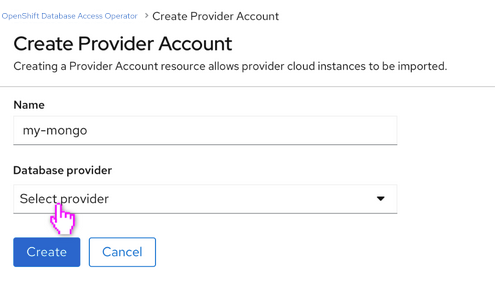
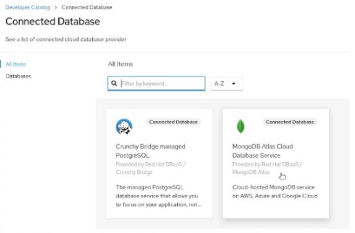
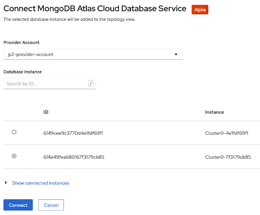
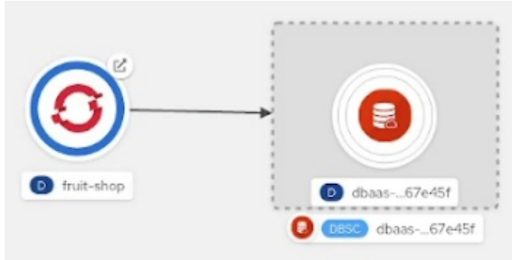

# Red Hat OpenShift Database Access Operator
Red Hat OpenShift Database Access Operator is a Alpha release. The intent of the alpha release is to show how we could
scan & import off-cluster cloud database instances hosted by partner providers CrunchyBridge and MongoDB Atlas & make those instances
available to developers for binding to their applications.

## Architecture Diagram

## Associated Github Repositories
Component |Git Repo	| Description
---  | ------ | ----
MongoDB Atlas Operator  |[MongoDB Atlas](https://github.com/mongodb/mongodb-atlas-kubernetes) | Operator responsible for establishing API communications with MongoDB Atlas Database.
Crunchy Bridge Operator |[Crunchy Bridge PostgreSQL](https://github.com/CrunchyData/crunchy-bridge-operator)|Operator responsible for establishing API communications with Crunchy Bridge Managed Postgres Database.
DBaaS Console Plugin    |[DBaaS Dynamic Plugin](https://github.com/RHEcosystemAppEng/dbaas-dynamic-plugin) | DBaaS UI console plugin, creation for “Provider Account” and a bindable “Connection” resource.
OpenShift Console Telemetry Plugin|[Console Telemetry Plugin](https://github.com/RHEcosystemAppEng/console-telemetry-plugin)|An OpenShift Console plugin for tracking user activity such as page changes, property changes, & specific UI events in segment.
Service Binding Operator|[Service Binding Operator](https://github.com/redhat-developer/service-binding-operator)|Red Hat operator for binding resources together via Topology View. 

## Building the Operator
Build the Red Hat OpenShift Database Access Operator image and push it to a public registry, such as quay.io:
- `make build`
- `make docker-build docker-push IMG=quay.io/<YOUR_USERNAME_IN_QUAY>/dbaas-operator:<version>`

## Running the Operator

**NOTE**: The DBaaS console UI portion of the workflow described below will *only* work if your operator is installed via OLM and using version OpenShift Container Platform (OCP) version 4.9 or higher.
If you run locally or via direct deploy (first 2
options), you can create a DBaaSInventory & will receive a DBaaSConnection, but will not see DBaaS console UI and bindable in Topology view.

**Run as a local instance**:
- `make install run INSTALL_NAMESPACE=<your_target_namespace> ENABLE_WEBHOOKS=false`
- Continue below by following the [Using the Operator](#using-the-operator) section
- When finished, remove created resources via:
  - `make clean-namespace`

**Deploy & run on a cluster:**
- `oc project <your_target_namespace>`
- `make deploy`
- Continue below by following the [Using the Operator](#using-the-operator) section
- When finished, clean up & remove deployment via:
  - `make clean-namespace undeploy`

**Deploy via OLM on cluster:**
- **Make sure to edit `Makefile` and replace `ORG` in the `IMAGE_TAG_BASE` with your own Quay.io Org!**
- **Next `make release-build`**
- **Next edit the [catalog-source.yaml](config/samples/catalog-source.yaml) template to indicate your new Quay.io org image**
- `make release-push catalog-update`
- Access to an OpenShift and navigate in the web console to the **Operators → OperatorHub** page.
- Scroll or type a keyword into the Filter by keyword box **OpenShift Database Access Operator** click Install.
  The RHODA operator is cluster scope and the default installed namespace is **openshift-dbaas-operator**. 
- On successful installation of RHODA operator, will automatically install all its dependencies and the operator logs shows: *DBaaS platform stack installation complete*.
- Continue below by following the [Using the Operator](#using-the-operator) section
- If you wish to uninstall operator and dependencies from your cluster: delete dbaas-platform(DBaaSPlatform) CR manually wait for the operator to uninstall its dependencies and then uninstall RHODA operators by going →**Operators → Installed Operators → Actions → Uninstall Operator**.
  Then delete the catalog source.

## Using the Operator

**Prerequisites:**
- An instance of OpenShift Container Platform (OCP) 4.9 or higher
- A database instance created using either the MongoDB Atlas or Crunchy Data Bridge cloud database provider.

**Creating a DBaaSInventory:**
- Click Operators → Installed Operators.
- Set the Project dropdown to the openshift-dbaas-operator project.
- Click the name of the OpenShift Database Access Operator to view the details page.
- Under Provided APIs, on the Provider Account tile, click Create instance to create a new provider account instance.
- Refresh the page if you are not seeing the DBaaS Console UI, this required only once to reload the plugin.
- On the Create Provider Account page, specify a name for the new Provider Account resource.
  
- Select your cloud database provider from the drop-down menu and provide the credentials for that provider.
- Click on the Create button to create the Provider Account resource and fetch the available database instances.
- If fetching is successful, then you can click on the View Provider Accounts button to display the exposed database instances that developers can import.
- For more understanding see the demo: [IT Operations preview demo of Red Hat OpenShift Database Access](https://www.youtube.com/watch?v=QmF5da2LvnU&t=0s&ab_channel=OpenShift)  

**Creating a DBaaSConnection:**
- Change into the Developer perspective. Click +Add.
- Select/Create the project to the application that you want to add the database to. Sample Quarkus application deployment for [mongo-db](config/samples/quarkus-mongodb-sample-app.yaml) & [crunchy-bridge](config/samples/quarkus-crunchydata-sample-app.yaml)
- From **Developer Catalog** Click on the **Database** category or select the **Connected Database**
  
- Select the database provider and click Connect.  
  
- Select the database provider and click Connect.  
  
- Upon successful connection, you are taken to the Topology page.
- Click and drag the arrow from the application to the new database instance to create a binding connector.
  
- For more understanding see the demo: [Developer preview demo of Red Hat OpenShift Database Access](https://www.youtube.com/watch?v=wEcqQziu17o&ab_channel=OpenShift)  
 
## Contributing

- Fork Red Hat OpenShift Database Access Operator repository
  - https://github.com/RHEcosystemAppEng/dbaas-operator
- Check out code from your new fork
  - `git clone git@github.com:<your-user-name>/dbaas-operator.git`
  - `cd dbaas-operator`
- Add upstream as git remote entry
  - `git remote add upstream git@github.com:RHEcosystemAppEng/dbaas-operator.git`
- create feature branches within your fork to complete your work
- raise PR's from your feature branch targeting upstream main branch
- add `jeremyary` (and others as needed) as reviewer
